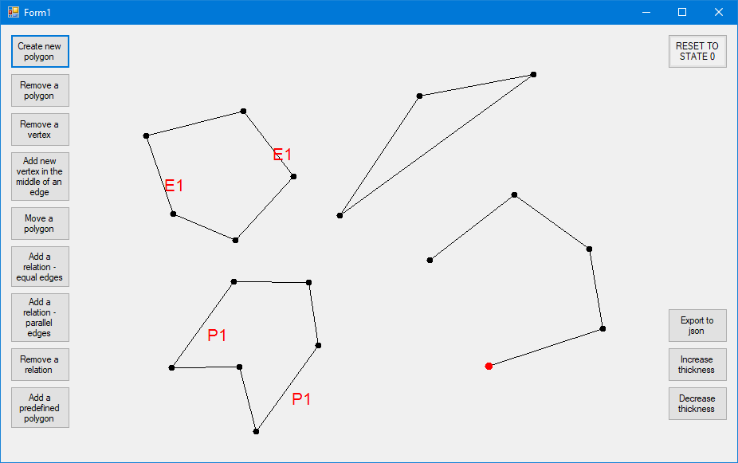

# PolygonEditor

An app with a graphical interface created with Windows Forms (Microsoft .NET Framework) in C#.

The app allows to draw and edit polygons and create relations between their edges.

## Table of Contents

* [General Info](#general-information)
* [Screenshot](#screenshot)
* [Features](#features)
* [Setup](#setup)
* [Contact](#contact)

## General Information

The application allows drawing polygons on the screen by designating their vertices. Once a polygon is created the user can modify it and create
relations between pairs of its edges such as equal length or parallel arrangement.

It is one of the projects which I have developed during my studies. Through this project, I could improve my skills with creating applications
with a graphical interface. The project also required solving some algorithmic problems: grabbing vertices and edges properly and repositioning
parts of the polygon appropriately so that the relations between the edges are maintained.

Most of the logic of the application and implementation of the algorithms can be found in the Form1.cs file.

## Screenshot

## Features

- Create multiple polygons by determining positions of their vertices
- Remove a polygon
- Remove a vertex of a polygon
- Add a new vertex in the middle of an edge of an existing polygon
- Move a polygon
- Add a relation of equal lengths of edges between a pair of edges (every time the polygon is modified, the program will try to maintain
the relation)
- Add a relation of parallel arrangement between a pair of edges
- Remove a relation
- Add a predefined polygon
- Export the data about existing polygons and relations in .json format
- Increase and decrease the thickness of the edges

## Setup

To build the project firstly you need to import the project into Visual Studio.

You need to have the Newtonsoft.Json package installed (a popular high-performance JSON framework for .NET).

## Contact

Created by Rafał Bogdanowicz - feel free to contact me by e-mail: <bogdaraf@gmail.com>